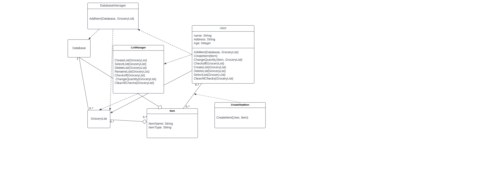
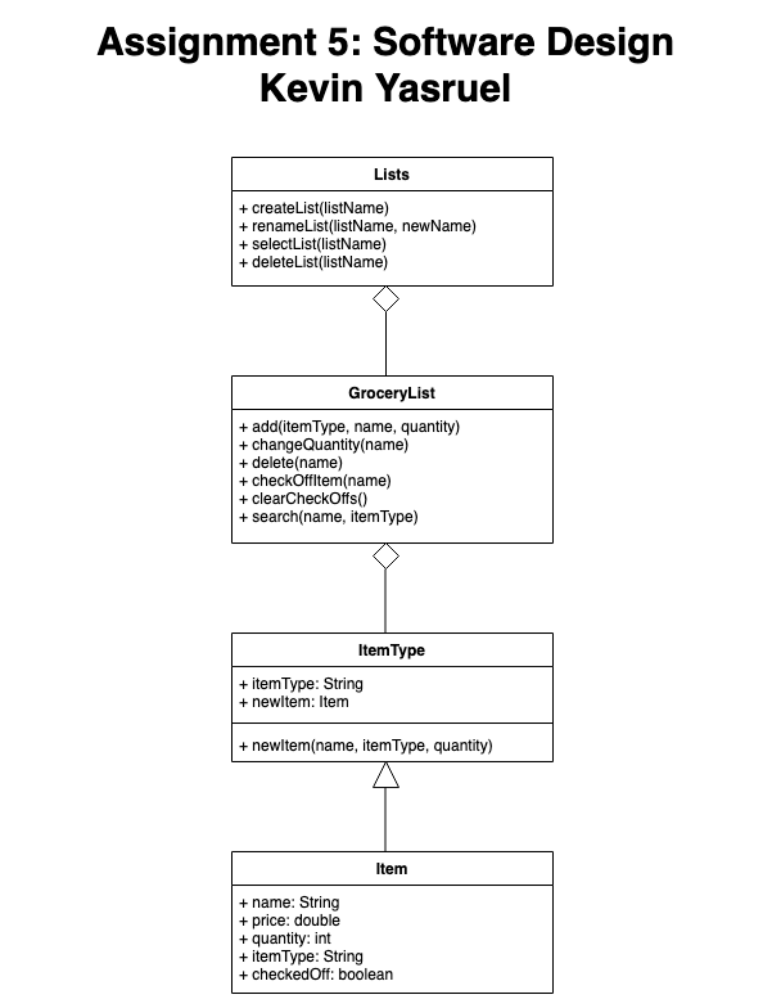
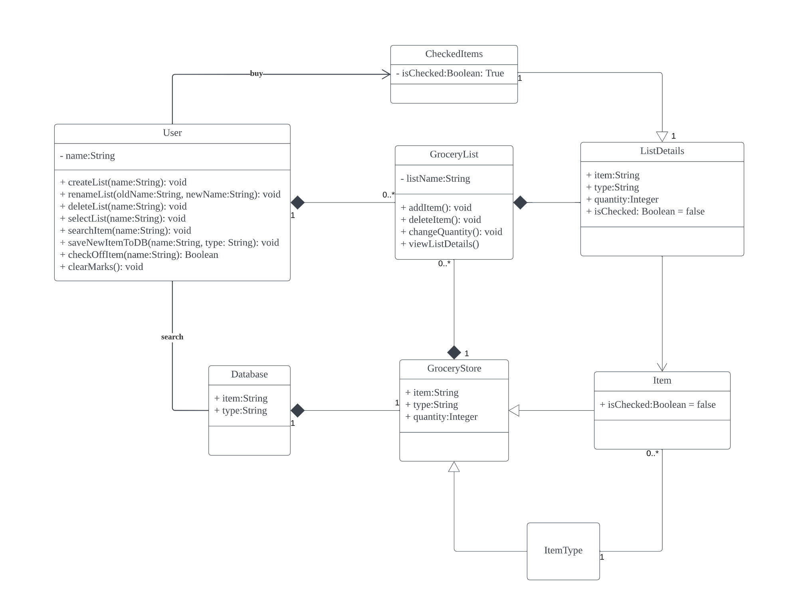
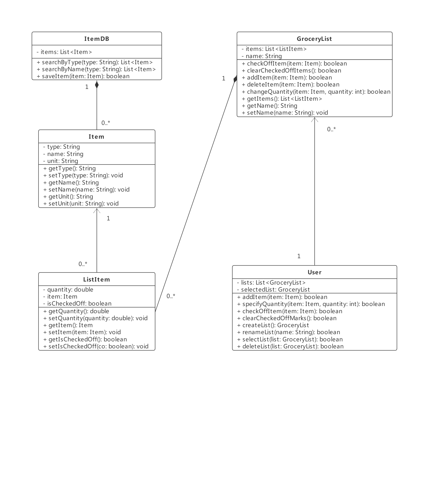
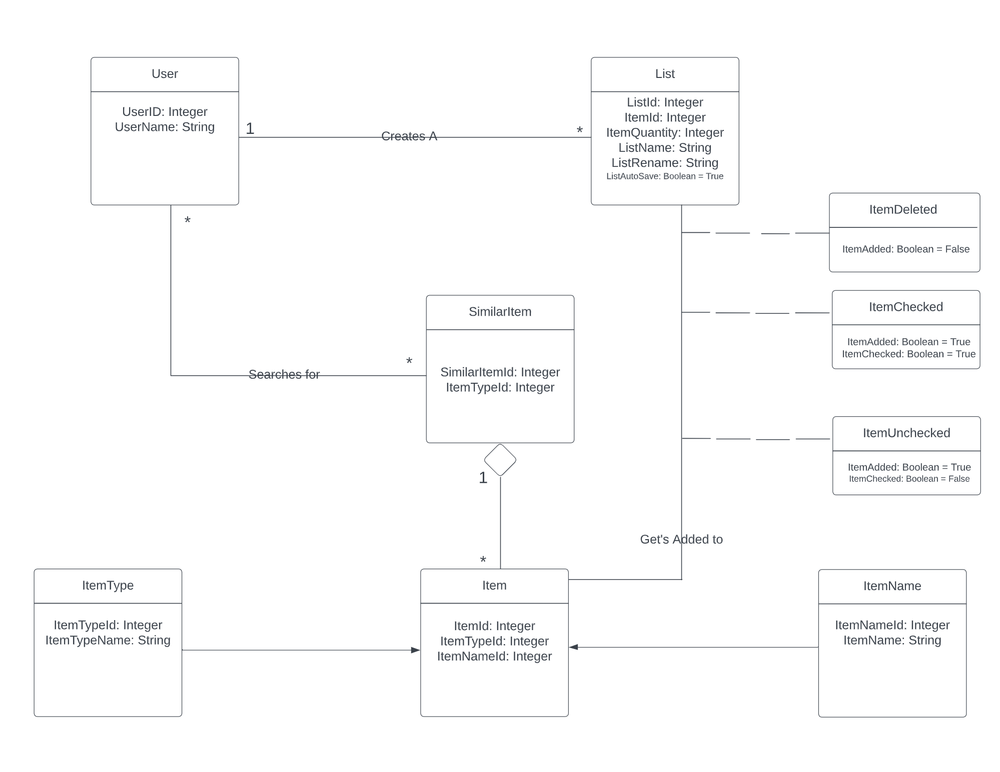

# Design-Discussion
## Design 1 David

Pros
* David's design had a good strucutre in terms of categorization. It contained proper columns and tables.
* Data types were logically correct 

Cons
* Complicated structure, seemed hard to follow
* The relationship design seemed very messy and all over the place

## Design 2 Kevin

Pros
* Kevin's design contained the necessary clases and tables along with columns

Cons
* Was not structured correctly 
* Missing database table
* Relationships were not placed correctly

## Design 3 Ludong

Pros
* Good structure
* Easy to navigate UML diagram
* Proper classes and tables
* Lots of columns with data types

Cons
* Difficult to transoform UML diagram to code
* Relationships were not clear also possibly a few unecessary relationships

## Design 4 Chen

Pros
* Very detailed UML Diagram
* Tons of classes and columns to work with
* Specfied each value and variable

Cons
* Everything seems bunched up
* Not enough tables
* Not enough relationships 
* Clustured 

## Design 5 Nate

Pros
* Easy to follow structure
* Clean and neat UML Diagram
* Columns and tables are created so it is easier to transition to code

Cons
* Missing database
* Not enough Columns

## Team Design 
We decided to use Nate's design as the primary layout for the team UML design. We wanted to implement Ludong's classes and tables as well as Chen's data usage. We felt as if Chen had a very detailed UML diagram but was not structured properly, therefore implementing the details from his diagram and transitoning to Nate's would make a detailed and well structured diagram. Nate's diagram gave Ludong idea's for an example the Itemunchecked, itemchecked and Itemdeleted classes and its column values.

## Summary
This was an icebreaker for all of us. Nobody knew eachother and it seemed as if everyone was timid at first. Going through the discussion it felt lik everyone started to get more comfortable and speak more. In terms of discussing pros and cons, we all were very respectful to one anothers work and we all are learning and understanding everyones strengths and weaknesses. As a team we are aware we must work as a cohesive unit, it may not be smooth sailing at first but we all agree that the more we work together and are involved with the project, the better we will be able to work together.

